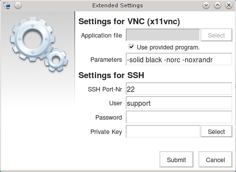

Remote Support Tool 0.5
=======================

*Remote Support Tool* is an easy single click solution for remote maintenance
via [VNC](https://en.wikipedia.org/wiki/Virtual_Network_Computing) inspired by
[UltraVNC Single Click](http://www.uvnc.com/products/uvnc-sc.html) and
[Gitso](https://code.google.com/p/gitso/).

About this program
------------------

[Remote administration](https://en.wikipedia.org/wiki/Remote_administration) is
common practice in software support for end users. There are a lot of different
solutions on the market, that can solve this task. But most of them are lacking
at least in one of these requirements:

-   The end user should be able to start the remote administration session with
    as less clicks as possible.

    -   No complex installation procedure should be required. The end user just
        has to download a single file and start it.

    -   The end user often sits behind a router / NAT and should not bother with
        port forwarding. On one hand this is quite complicated process for an
        end user and on the other hand it is a possible security risk to open
        local ports to the internet.

-   The remote maintenance session should be completely private and secure.

    -   All transferred data has to be encrypted - especially when it is sent
        over the internet

    -   Most commercial solutions are initiating (or even routing) the traffic
        through their own servers. This can become a privacy problem -
        especially if the servers are located in countries with loose data
        privacy policies.

-   All major operating systems for desktop PC's should be supported.

-   Support for different languages - because not all end users speak English.

Because we did not find a solution that fits all of these requirements, we've
decided to build our own little application based on
[VNC](https://en.wikipedia.org/wiki/Virtual_Network_Computing). In general this
application behaves similar to the
[UltraVNC Single Click](http://www.uvnc.com/products/uvnc-sc.html) solution -
but it also provides encryption and supports Linux and Mac OS X.

In addition we wanted to make this program customizable for other companies.

-   A company may provide custom configuration files together with the
    executable binary.

-   A company may compile its configurations directly into the executable
    binary. This makes it possible to provide a single executable file for the
    end users, that contains all required configurations by default.

In both cases the end user just has to click the *Connect* button and does not
have to change any settings.

### Application dialog

In the best case the end user will just have to click the *Connect* button. But
maybe the support staff will have to tell his IP address to the end user.
Therefore the user will find the most basic settings directly in the application
window.

### Extended settings dialog

All relevant settings for a VNC reverse connection (tunneled through SSH) can be
modified in the extended settings dialog if necessary.

Documentation
-------------

You can find documentations about *Remote Support Tool* in the
[project wiki](https://github.com/OpenIndex/RemoteSupportTool/wiki).

Bundled applications
--------------------

The following applications are bundled into *Remote Support Tool* (depending on
the operating system):

-   for Linux

    -   [x11vnc 0.9.13](http://www.karlrunge.com/x11vnc/) (GPLv2) created with
        the [`build-x11vnc.tcl`](utils/build-x11vnc.tcl) script

-   for Mac OS X (10.7+)

    -   [OSXvnc 5.0.1](https://github.com/stweil/OSXvnc) (GPLv2) using binaries
        from [github.com](https://github.com/stweil/OSXvnc/releases)

-   for Windows (Vista and newer)

    -   [TightVNC 2.8.5](http://www.tightvnc.com/) (GPLv2) using binaries from
        [tightvnc.com](http://www.tightvnc.com/download.php)

    -   [OpenSSH 7.4p1-1](https://www.openssh.com/) (BSD) using binaries from
        [mls-software.com](https://www.mls-software.com/opensshd.html)

-   for Windows (XP / 2003)

    -   [TightVNC 2.8.5](http://www.tightvnc.com/) (GPLv2) using binaries from
        [tightvnc.com](http://www.tightvnc.com/download.php)

    -   [OpenSSH 7.3p1-2](https://www.openssh.com/) (BSD) using binaries from
        [mls-software.com](https://www.mls-software.com/opensshd-old-cygwin.html)

Bundled components
------------------

The following third party components are bundled into the application:

-   [Tcl/Tk](http://www.tcl.tk/) (BSD)
-   [inifile](https://github.com/tcltk/tcllib/tree/master/modules/inifile) (BSD)
-   [scrolledframe](http://wiki.tcl.tk/9223) (Public Domain)
-   [Crystal Clear Icons](http://www.everaldo.com/) (LGPL)

Created with
------------

-   A custom [Tclkit](http://wiki.tcl.tk/52) is used in order to create
    application binaries. For each supported target system the Tclkit can be
    found in the [`utils`](utils) folder.

-   The Tclkits for Linux and Mac OS X were created with
    [KitCreator](https://kitcreator.rkeene.org/) through the
    [`build-x11vnc.tcl`](utils/build-tclkit.tcl) script.

-   The Tclkit for Windows was created with KitCreator's
    [Interactive Build System](http://kitcreator.rkeene.org/kitcreator).

Supported operating systems
---------------------------

-   Windows (XP or newer)
-   Mac OS X (10.7 or newer)
-   Linux (i386 / amd64)

Translations
------------

*Remote Support Tool* is developed in **English** and is already into
**German** language. The
[translation documentation](https://github.com/OpenIndex/RemoteSupportTool/wiki/Translation)
contains informations about how to translate the application for yourself. Feel
free to send your translation files to us.

License
-------

This application is licensed under the terms of the
[MIT License](http://opensource.org/licenses/MIT). Take a look at
[`LICENSE.txt`](LICENSE.txt) for the license text.

Further informations
--------------------

-   [*Remote Support Tool* at GitHub](https://github.com/OpenIndex/RemoteSupportTool)
-   [Releases of *Remote Support Tool*](https://github.com/OpenIndex/RemoteSupportTool/releases)
-   [Changelog of *Remote Support Tool*](https://github.com/OpenIndex/RemoteSupportTool/blob/develop/CHANGELOG.md)
-   [Documentation of *Remote Support Tool*](https://github.com/OpenIndex/RemoteSupportTool/wiki)
