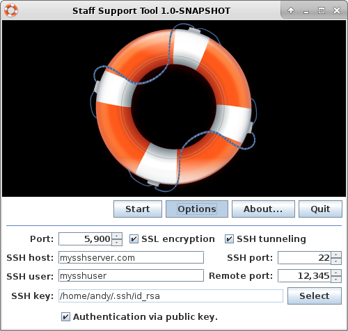

Remote Support Tool 1.2.0-SNAPSHOT
==================================

*Remote Support Tool* is an easy single click solution for remote maintenance.

This project started initially as a [VNC](https://en.wikipedia.org/wiki/Virtual_Network_Computing) launcher inspired by [UltraVNC Single Click](http://www.uvnc.com/products/uvnc-sc.html) and [Gitso](https://code.google.com/p/gitso/). For a more consistent platform support and better compatibility the software was completely rewritten in Java and the requirement of any third party VNC software was dropped.

*Remote Support Tool* provides a graphical interface for both sides of a remote support session:

-   *Customer Support Tool* is started by the customer, who likes to provide access on his desktop for a support staff.

-   *Staff Support Tool* is started by the support staff in order to access the customers desktop remotely. 

Because both sides of a support session are covered by *Remote Support Tool*, the software uses its own protocol for communication between customer and staff. The application is currently **not compatible with other VNC based software**. 

About this program
------------------

### Motivation

[Remote administration](https://en.wikipedia.org/wiki/Remote_administration) is common practice in software support for end users. There are a lot of different solutions on the market, that can solve this task. But most of them are lacking at least in one of these requirements:

-   The end user should be able to start the remote administration session with as less clicks as possible.

    -   No complex installation procedure should be required. The end user just has to download a single file and start it.

    -   The end user often sits behind a router / NAT and should not bother with port forwarding. On one hand this is quite complicated process for an end user and on the other hand it is a possible security risk to open local ports to the internet.

-   The remote maintenance session should be completely private and secure.

    -   All transferred data has to be encrypted - especially when it is sent over the internet

    -   Most commercial solutions are initiating (or even routing) the traffic through their own servers. This can become a privacy problem - especially if the servers are located in countries with loose data privacy policies.

-   All major operating systems for desktop PC's should be supported.

-   Support for different languages - because not all end users speak English.

Because we did not find a solution that fits all of these requirements, we've decided to build our own solution to fit this gap. From a customer perspective this application behaves similar to the [UltraVNC Single Click](http://www.uvnc.com/products/uvnc-sc.html) solution - but it also provides encryption and supports Linux and macOS.

In addition we wanted to make this program customizable for other companies. A company may compile a custom configuration into the application. This makes it possible to provide a single executable file for the end users, that contains all required configurations by default.

### Customer Support Tool

From the customer perspective the software is as simple as possible. Only a hostname / IP address and port number has to be provided in order to share the screen with the support staff. If the customer uses multiple monitors, he also might select which screen he likes to share.

A company, that offers remote support, can create its custom preconfigured build of this software, that provides all necessary settings by default. In this case the customer will just have to click the *Connect* button after starting the application. According to our goal this is the **easiest solution possible** from the customer perspective.

### Staff Support Tool

At minimum the support staff only has to provide a port number, on which the customer will connect. If the customer is connecting through the internet, SSL encryption is recommended. In order to avoid problems with port forwarding in the local router, the support staff might also enable SSH tunneling (SSH remote port forwarding).

### Features

-   support staff can remotely access the customers screen
    -   send keyboard and mouse inputs to the customer for remote control
    -   screen is transferred with JPG compression
    -   only changed regions of the screen are transferred
-   private and secure
    -   integrated SSL encryption
    -   integrated SSH tunneling (remote port forwarding) in order to avoid any 
        changes to the router settings
    -   ssh authentication via password or public key
-   simple to use
    -   no external dependencies required
    -   integrated OpenJDK runtime environment 
    -   single file launchers; just download and start the application
    -   signed application bundle for macOS
-   cross platform 
    -   support for Windows
    -   support for macOS
    -   support for Linux
-   multilingual
    -   available in English & German
    -   translatable in other languages if necessary
-   customizable
    -   provide the necessary default settings to make the application as easy
        as possible to use for the customer
    -   add your company logo as a branding
-   business friendly Open Source license 
    ([Apache License 2.0](https://www.apache.org/licenses/LICENSE-2.0.html))
    
    
### Planned features

-   file transfers 
    (see [issue #12](https://github.com/OpenIndex/RemoteSupportTool/issues/12))
-   shared clipboard 
    (see [issue #13](https://github.com/OpenIndex/RemoteSupportTool/issues/13))

see full [list of proposed enhancements](https://github.com/OpenIndex/RemoteSupportTool/issues?q=is%3Aissue+is%3Aopen+label%3Aenhancement)

Supported operating systems
---------------------------

-   Windows (7 or newer, 32bit & 64bit) 
-   Mac OS X (10.9 or newer)
-   Linux (i386 / amd64)

### Notes about Windows

Due to a restriction in the Windows operating system the customer's desktop does not allow any interaction, if an application with administrative privileges is currently running. In this case the customer either has to close the administrative application or needs to start *Customer Support Tool* with administrator privileges.

### Notes about macOS

Starting with macOS Mojave (10.14) the customer explicitly needs to allow access to the application after the support session was started. The same applies to other remote support software like TeamViewer. They've described the necessary steps on their [Knowledge Base page](https://community.teamviewer.com/t5/Knowledge-Base/How-to-control-a-Mac-running-macOS-10-14-Mojave/ta-p/44699).

### Notes about Linux

Currently the support session is not working for customers using [Wayland](https://en.wikipedia.org/wiki/Wayland_(display_server_protocol)). Currently it is not widely used yet. Fortunately most Linux distributions still use X.org - but for example Fedora is already shipping Wayland in its default installation. We're trying to find a solution for this problem as soon as possible (see [issue #24](https://github.com/OpenIndex/RemoteSupportTool/issues/24)). 

Translations
------------

*Remote Support Tool* is developed in **English** and is translated into **German** language. The [configuration documentation](https://github.com/OpenIndex/RemoteSupportTool/wiki/Configuration) contains information about how to translate the application for yourself. Feel free to send your translation files to us.

Documentation
-------------

You can find documentations about *Remote Support Tool* in the [project wiki](https://github.com/OpenIndex/RemoteSupportTool/wiki).

Support
-------

We are providing [professional support](https://github.com/OpenIndex/RemoteSupportTool/wiki/Service) for *Remote Support Tool* in case you can't or don't want to customize the application for yourself. 

License
-------

This application is licensed under the terms of the [Apache License 2.0](https://www.apache.org/licenses/LICENSE-2.0.html). Take a look at [`LICENSE.txt`](LICENSE.txt) for the license text.

Third party components
----------------------

The following third party components are bundled into the application (in alphabetical order):

-   [Commons IO](https://commons.apache.org/io/) 2.6
    [(Apache License 2.0)](https://raw.githubusercontent.com/apache/commons-io/master/LICENSE.txt)
-   [Commons Lang](https://commons.apache.org/lang/) 3.8.1
    [(Apache License 2.0)](https://raw.githubusercontent.com/apache/commons-lang/master/LICENSE.txt)
-   [Commons Text](https://commons.apache.org/text/) 1.6
    [(Apache License 2.0)](https://raw.githubusercontent.com/apache/commons-text/master/LICENSE.txt)
-   [Crystal Project Icons](https://github.com/pinhead84/crystal-project)
    [(LGPL 2.1)](https://web.archive.org/web/20101122171611/http://everaldo.com/crystal/?action=license)
-   [imgscalr](https://github.com/rkalla/imgscalr) rev-8ed3644
    [(Apache License 2.0)](https://raw.githubusercontent.com/rkalla/imgscalr/master/LICENSE)
-   [Java Native Access](https://github.com/java-native-access/jna) 5.2.0
    [(Apache License 2.0)](https://github.com/java-native-access/jna/blob/master/LICENSE)
-   [JSch](http://www.jcraft.com/jsch/) 0.1.55
    [(BSD)](http://www.jcraft.com/jsch/LICENSE.txt)
-   [JZlib](http://www.jcraft.com/jzlib/) 1.1.3
    [(BSD)](http://www.jcraft.com/jzlib/LICENSE.txt)
-   [Logback](https://logback.qos.ch/) 1.2.3
    [(LGPL 2.1)](https://logback.qos.ch/license.html)
-   [MigLayout](http://miglayout.com/) 5.2
    [(BSD)](https://raw.githubusercontent.com/mikaelgrev/miglayout/master/src/site/resources/docs/license.txt)
-   [OpenJDK Runtime Environment](https://openjdk.java.net/) 11
    [(GPL 2 with Classpath Exception)](https://openjdk.java.net/legal/gplv2+ce.html)
-   [Simple Logging Facade for Java](https://www.slf4j.org/) 1.7.26
    [(MIT)](https://www.slf4j.org/license.html)

We especially like to thank [BellSoft](https://www.bell-sw.com/) and [AdoptOpenJDK](https://adoptopenjdk.net/) for providing the high quality OpenJDK builds, that are bundled with this application.

Further information
-------------------

-   [*Remote Support Tool* at GitHub](https://github.com/OpenIndex/RemoteSupportTool)
-   [Releases of *Remote Support Tool*](https://github.com/OpenIndex/RemoteSupportTool/releases)
-   [Changelog of *Remote Support Tool*](https://github.com/OpenIndex/RemoteSupportTool/blob/develop/CHANGELOG.md)
-   [Documentation of *Remote Support Tool*](https://github.com/OpenIndex/RemoteSupportTool/wiki)
